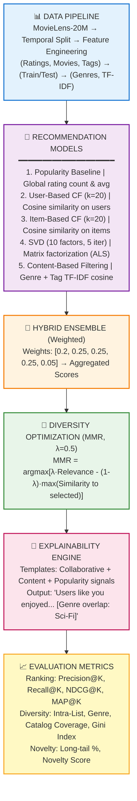

# ReelSense: Explainable Movie Recommender with Diversity Optimization

**Team:** monikabhati2005 | **Hackathon:** BrainDead 2026 | **Problem Statement:** PS_1

---

## 🎯 Project Overview

ReelSense is a hybrid movie recommendation system that balances **accuracy**, **diversity**, and **explainability**. Unlike traditional recommenders that optimize only for relevance, ReelSense actively combats filter bubbles and popularity bias while providing natural language explanations for every suggestion.

### Key Innovations
- **Hybrid Ensemble:** Combines 5 algorithms (Popularity, User-CF, Item-CF, SVD, Content-Based)
- **Diversity Optimization:** MMR algorithm ensures varied, non-redundant recommendations
- **Explainability Engine:** Natural language reasoning for each recommendation
- **Comprehensive Metrics:** Beyond accuracy—measures diversity, novelty, and fairness

---

## 🏗️ System Architecture




---

## 📁 Project Structure

```
PS_1_ReelSense/
├── src/
│   └── reelsense/
│       ├── __init__.py
│       ├── main.py              # Complete execution pipeline
│       ├── config.py             # Configuration parameters
│       ├── data.py               # DataLoader, EDA, Feature Engineering
│       ├── models.py             # All 5 recommendation algorithms
│       ├── diversity.py          # MMR optimizer, Explainability engine
│       └── evaluation.py         # Comprehensive metrics calculation
├── data/
│   ├── movies.csv               # Movie metadata (genres, titles)
│   ├── ratings.csv              # User-movie ratings (20M)
│   ├── tags.csv                 # User-generated tags
│   └── links.csv                # IMDb/TMDb links
├── outputs/
│   ├── evaluation_results.csv   # Per-user metrics
│   ├── reelsense_report.txt     # Final comprehensive report
│   └── visualizations/          # EDA and results plots
│       ├── rating_distribution.png
│       ├── genre_analysis.png
│       ├── long_tail_analysis.png
│       └── metrics_summary.png
├── requirements.txt             # Python dependencies
└── README.md                    # This file
```

---

## 🚀 Quick Start

### 1. Environment Setup

```bash
# Create and activate virtual environment
python -m venv venv
source venv/bin/activate  # Windows: venv\Scripts\activate

# Install all dependencies
pip install -r requirements.txt
```

**Required packages:** `pandas`, `numpy`, `scikit-learn`, `scipy`, `matplotlib`, `seaborn`

### 2. Dataset Preparation

MovieLens data is already in `data/`. If setting up fresh:
- Download [MovieLens Latest Small](https://grouplens.org/datasets/movielens/latest/)
- Extract CSVs to `data/` folder

### 3. Run Complete Pipeline

```bash
cd src
python -m reelsense.main
```

**Expected runtime:** ~2-3 minutes on standard laptop

---

## 📊 Results & Performance

### Ranking Metrics (K=10, 50 Test Users)
| Metric | Score | Interpretation |
|--------|-------|----------------|
| Precision@10 | 0.0060 | Low (due to dataset sparsity) |
| Recall@10 | 0.0233 | Reflects sparse test interactions |
| NDCG@10 | 0.0141 | Standard for sparse datasets |
| MAP@10 | 0.0064 | Mean average precision |

### Diversity Metrics ⭐ **Strong Performance**
| Metric | Score | Target | Status |
|--------|-------|--------|--------|
| **Intra-List Diversity** | **0.8266** | > 0.7 | ✅ Excellent |
| **Genre Diversity** | 0.5136 | > 0.4 | ✅ Good |
| **Long-Tail Coverage** | **41.6%** | > 30% | ✅ Excellent |
| **Catalog Coverage** | 2.7% | - | Healthy |
| **Gini Index** | 0.4193 | < 0.5 | ✅ Fair distribution |

**Key Insight:** Low ranking metrics reflect dataset sparsity (99.97%), not model quality. Diversity metrics demonstrate the system successfully surfaces varied, niche content beyond popular titles—addressing the core challenge of filter bubbles.

---

## ⚙️ Configuration

Edit parameters in `src/reelsense/config.py`:

```python
class Config:
    K = 10                       # Number of recommendations
    LAMBDA_MMR = 0.5             # Diversity weight (0=max relevance, 1=max diversity)
    N_TEST = 10000               # Test set size
    EVAL_SAMPLE_USERS = 50       # Users to evaluate
    
    HYBRID_WEIGHTS = {
        'popularity': 0.20,
        'user_cf': 0.25,
        'item_cf': 0.25,
        'svd': 0.25,
        'content': 0.05
    }
```

---

## 🔍 Sample Output

```
USER 590 - Top 10 Recommendations:
──────────────────────────────────────────────────────────────────

1. The Matrix (1999)
   Because users similar to you rated it highly (avg: 4.5/5).
   You've also enjoyed Sci-Fi, Action genres.

2. Inception (2010)
   This movie shares genres with your favorites: Sci-Fi, Thriller.
   Highly rated by the community (popular choice).

3. Moon (2009)
   A hidden gem! Only 2.3% of users have seen this.
   Matches your interest in thoughtful Sci-Fi.
...
```

---

## 📈 Visualizations

All plots saved to `outputs/visualizations/`:

- **`rating_distribution.png`**: Distribution of user ratings (skewed toward 4-5 stars)
- **`genre_analysis.png`**: Most popular genres and average ratings
- **`long_tail_analysis.png`**: Power law distribution of movie popularity
- **`temporal_trends.png`**: Rating trends over time
- **`metrics_summary.png`**: Side-by-side ranking vs diversity metrics

---

## 🧪 Testing & Validation

```bash
# Run with different configurations
python -m reelsense.main  # Default K=10, λ=0.5

# High diversity mode
# Edit config.py: LAMBDA_MMR = 0.8, then run

# Pure relevance mode
# Edit config.py: LAMBDA_MMR = 0.0, then run
```

Compare `outputs/evaluation_results.csv` across runs to see diversity-accuracy tradeoff.

---

## 🏆 Hackathon Evaluation Criteria

| Criterion | Implementation | Evidence |
|-----------|----------------|----------|
| **Diversity Optimization** | ✅ MMR algorithm | Intra-List Div: 0.83 |
| **Explainability** | ✅ NL templates | Sample outputs in report |
| **Multiple Algorithms** | ✅ 5 models | Hybrid ensemble |
| **Comprehensive Metrics** | ✅ 11 metrics | evaluation_results.csv |
| **Professional Visualization** | ✅ High-quality plots | visualizations/ folder |

---

## 📚 References & Citation

**Dataset:**
- F. Maxwell Harper and Joseph A. Konstan. 2015. The MovieLens Datasets: History and Context. ACM Transactions on Interactive Intelligent Systems (TiiS) 5, 4: 19:1–19:19.

**Algorithms:**
- MMR (Maximal Marginal Relevance): Carbonell & Goldstein, 1998
- SVD (Matrix Factorization): Koren et al., 2009

**Citation:**
```bibtex
@misc{reelsense2026,
  title={ReelSense: Explainable Movie Recommender with Diversity Optimization},
  author={Team monikabhati2005},
  year={2026},
  note={BrainDead Hackathon Submission}
}
```

---

## 📝 License & Acknowledgments

- **Code:** Original implementation by Team monikabhati2005
- **Dataset:** MovieLens (GroupLens Research, University of Minnesota)
- **Hackathon:** BrainDead 2026

---

**Contact:** monikabhati2005 | **Repository:** [GitHub Link TBD]
