# Cognitive Radiology Assistant: Automated Medical Report Generation

**Team:** monikabhati2005 | **Hackathon:** BrainDead 2026 | **Problem Statement:** PS_2

---

## 🎯 Project Overview

The Cognitive Radiology Assistant generates comprehensive diagnostic reports from chest X-rays using a **vision-language model** with three mandatory modules:

1. **PRO-FA (Progressive Feature Alignment):** Hierarchical visual encoding at pixel, region, and organ levels
2. **MIX-MLP (Multi-task Knowledge-Enhanced MLP):** 14-disease classification with pathology predictions
3. **RCTA (Recursive Cognitive Triangular Attention):** Tri-modal attention fusing image, clinical indication, and disease features
4. **Clinical Grounding (Inference Safety):** Template-based factual anchoring using pathology-specific thresholds

---

## 🏗️ System Architecture

```mermaid
flowchart LR
    A[Chest X-Ray<br/>224x224] --> B[Vision Transformer<br/>ViT-B/16]
    
    B --> C1[Pixel Features<br/>196 x 512]
    B --> C2[Region Features<br/>49 x 512]
    B --> C3[Organ Features<br/>1 x 512]
    
    C3 --> D[Disease Classifier<br/>MLP Network]
    D --> E[14 Disease Scores]
    
    C1 --> F[Image<br/>Embeddings]
    C2 --> F
    
    G[Clinical Text] --> H[Text Encoder<br/>DistilBERT]
    H --> I[Clinical<br/>Embeddings]
    
    E --> J[Disease<br/>Embeddings]
    
    F --> K[Triangular Attention<br/>RCTA Module]
    I --> K
    J --> K
    
    K --> L[Verified<br/>Features]
    L --> M[Report Generator<br/>DistilGPT2]
    M --> O[Clinical Grounding<br/>Module 4]
    O --> N[Medical Report<br/>FINDINGS + IMPRESSION]
    
    style A fill:#0277BD,stroke:#01579B,stroke-width:3px,color:#fff
    style B fill:#0277BD,stroke:#01579B,stroke-width:4px,color:#fff
    style C1 fill:#0288D1,stroke:#01579B,stroke-width:2px,color:#fff
    style C2 fill:#0288D1,stroke:#01579B,stroke-width:2px,color:#fff
    style C3 fill:#0288D1,stroke:#01579B,stroke-width:2px,color:#fff
    
    style D fill:#7B1FA2,stroke:#4A148C,stroke-width:4px,color:#fff
    style E fill:#8E24AA,stroke:#4A148C,stroke-width:2px,color:#fff
    
    style F fill:#EF6C00,stroke:#BF360C,stroke-width:2px,color:#fff
    style G fill:#F9A825,stroke:#F57F17,stroke-width:3px,color:#fff
    style H fill:#F9A825,stroke:#F57F17,stroke-width:2px,color:#fff
    style I fill:#EF6C00,stroke:#BF360C,stroke-width:2px,color:#fff
    style J fill:#8E24AA,stroke:#4A148C,stroke-width:2px,color:#fff
    
    style K fill:#D84315,stroke:#BF360C,stroke-width:5px,color:#fff
    style L fill:#E64A19,stroke:#BF360C,stroke-width:2px,color:#fff
    
    style M fill:#388E3C,stroke:#1B5E20,stroke-width:4px,color:#fff
    style O fill:#43A047,stroke:#1B5E20,stroke-width:3px,color:#fff
    style N fill:#43A047,stroke:#1B5E20,stroke-width:2px,color:#fff
```




**Architecture Overview:**

| Stage | Component | Description | Output |
|-------|-----------|-------------|--------|
| **Input** | Chest X-Ray | 224×224 grayscale image | Raw image tensor |
| **MODULE 1: PRO-FA** | Vision Transformer | Hierarchical feature extraction | Pixel (196×512), Region (49×512), Organ (1×512) |
| **MODULE 2: MIX-MLP** | Disease Classifier | 14-pathology prediction | Disease probabilities [0,1]^14 |
| **Clinical Encoding** | DistilBERT | Clinical indication processing | 512-dim text embedding |
| **MODULE 3: RCTA** | Triangular Attention | Tri-modal fusion (Image⊗Clinical⊗Disease) | Verified features (512-dim) |
| **Decoder** | DistilGPT2 | Report generation with beam search | Medical text report |
| **MODULE 4: CLINICAL GROUNDING** | Safety Mechanism | Template-based factual anchoring | Verified clinical report |

**Color Legend:**
- **Blue** = Visual Processing (PRO-FA)
- **Purple** = Disease Classification (MIX-MLP)  
- **Orange/Yellow** = Clinical Text Processing
- **Red-Orange** = Triangular Attention (RCTA)
- **Green** = Report Generation


---

## 📁 Project Structure

```
PS_2_Cognitive_Radiology_Report/
├── models/
│   ├── encoder.py               # MODULE 1: PRO-FA implementation
│   ├── classifier.py            # MODULE 2: MIX-MLP implementation
│   ├── attention.py             # MODULE 3: RCTA implementation
│   ├── cognitive_model.py       # Complete integrated model
│   └── dataset.py               # ChestXrayDataset, data transforms
├── training/
│   └── train.py                 # Training loop with checkpointing
├── evaluation/
│   └── evaluate.py              # CheXpert F1, RadGraph F1, CIDEr, BLEU-4
├── scripts/
│   ├── download_data.sh         # Dataset download scripts
│   ├── download_with_hub.py     # HuggingFace dataset download
│   ├── download_mimic.py        # MIMIC-CXR download
│   ├── preprocess_iu_xray.py    # IU X-Ray preprocessing
│   ├── preprocess_mimic.py      # MIMIC-CXR preprocessing
│   ├── generate_reports.py      # Inference script
│   └── gui_app.py               # Interactive GUI demo (PySide6)
├── data/                        # Dataset directory (git-ignored)
├── checkpoints/                 # Trained model weights
├── notebooks/
│   ├── Run_on_Colab.ipynb       # Google Colab training notebook
│   └── Run_on_Kaggle.ipynb      # Kaggle P100 GPU notebook
├── requirements.txt             # Python dependencies
├── pack_project.py              # Zip codebase for submission
├── submission.txt               # Submission links file
└── README.md                    # This file
```

---

## 🚀 Quick Start

### Option 1: Google Colab (Recommended for Training)

**Best for:** Training on GPU without local setup

1. **Prerequisites:**
   - Google account for Colab
   - Kaggle account + API token (`kaggle.json`)

2. **Steps:**
   ```bash
   # Download project codebase
   # Go to Google Colab: https://colab.research.google.com/
   # Upload Run_on_Colab.ipynb
   # Upload project_codebase.zip and kaggle.json
   # Run all cells
   ```

3. **What it does:**
   - Installs dependencies
   - Downloads IU X-Ray or MIMIC-CXR
   - Trains model for 15 epochs
   - Saves checkpoint to `/content/checkpoints/`

### Option 2: Local Setup (For Inference/GUI Demo)

**Best for:** Running pre-trained model and GUI demo

```bash
# 1. Create virtual environment
python -m venv venv
source venv/bin/activate  # Windows: venv\Scripts\activate

# 2. Install dependencies
pip install -r requirements.txt

# 3. Run GUI Demo
python scripts/gui_app.py
```

**GUI Features:**
- Load trained checkpoint
- Upload chest X-ray
- Execute diagnostic scan with visual animations
- View generated report + disease probabilities
- Professional medical interface

### Option 3: Kaggle Notebooks (P100 GPU)

**Best for:** Fast training with more memory

1. Upload `Run_on_Kaggle.ipynb` to Kaggle
2. Enable GPU accelerator (Settings → Accelerator → GPU P100)
3. Add IU X-Ray or MIMIC-CXR dataset
4. Run all cells

---

## 📊 Datasets

### IU X-Ray (Indiana University)
- **Images:** 7,470 frontal chest X-rays
- **Reports:** Paired radiology reports with findings & impressions
- **Diseases:** 14 CheXpert pathology labels

### MIMIC-CXR (MIT)
- **Images:** 377,110 chest X-rays (227K patients)
- **Reports:** De-identified radiology reports
- **Diseases:** Same 14 CheXpert labels
- **Challenge:** Nested directory structure (handled in dataset.py)

**Download:**
```bash
# Via Kaggle API (fastest)
python scripts/download_with_hub.py  # IU X-Ray
python scripts/download_mimic.py     # MIMIC-CXR

# Manual: Download from Kaggle datasets and place in data/
```

---

## 🧠 Module Implementation Details

### MODULE 1: PRO-FA (Hierarchical Visual Alignment)

**File:** [`models/encoder.py`](models/encoder.py)

```python
class PROFA(nn.Module):
    """
    Progressive Feature Alignment extracts multi-scale visual features
    from a pre-trained Vision Transformer (ViT-B/16).
    """
    def forward(self, images):
        # Extract ViT features [B, 197, 768]
        features = self.vit.forward_features(images)
        
        # Level 1: Organ (global context from CLS token)
        organ_feat = self.organ_proj(features[:, 0])  # [B, 512]
        
        # Level 2: Region (7×7 pooled patches)
        patch_grid = features[:, 1:].reshape(B, 14, 14, 768)
        region_feat = avg_pool2d(patch_grid, kernel_size=2)  # [B, 49, 512]
        
        # Level 3: Pixel (all 196 patches)
        pixel_feat = self.pixel_proj(features[:, 1:])  # [B, 196, 512]
        
        return {'pixel': pixel_feat, 'region': region_feat, 'organ': organ_feat}
```

**Key Design Choice:** Multi-granular features allow the model to capture both fine anatomical details (pixels) and global pathology context (organ), mimicking radiologist analysis.

### MODULE 2: MIX-MLP (Multi-task Knowledge-Enhanced MLP)

**File:** [`models/classifier.py`](models/classifier.py)

```python
class MIXMLP(nn.Module):
    """
    Multi-Layer Perceptron for 14-disease classification.
    Uses class weighting to handle label imbalance."""
    def forward(self, organ_features):
        # organ_features: [B, 512]
        x = F.relu(self.fc1(organ_features))       # [B, 256]
        x = self.dropout(x)
        x = F.relu(self.fc2(x))                    # [B, 128]
        logits = self.fc3(x)                       # [B, 14]
        return logits  # Apply sigmoid for probabilities: p = σ(logits)
```

**Loss:** Binary cross-entropy with class weights to address dataset imbalance (e.g., "No Finding" is more common than "Pneumothorax").

### MODULE 3: RCTA (Recursive Cognitive Triangular Attention)

**File:** [`models/attention.py`](models/attention.py)

```python
class RCTA(nn.Module):
    """
    Triangular attention mechanism that fuses:
    - Image features (from PRO-FA)
    - Clinical indication (from text encoder)
    - Disease predictions (from MIX-MLP)
    """
    def forward(self, img_feat, clinical_feat, disease_feat):
        # Image as Query, Clinical/Disease as Key-Value
        Q_img = self.q_proj(img_feat)
        
        # Attend to clinical context
        K_clin, V_clin = self.kv_clin(clinical_feat)
        attn_clin = softmax(Q_img @ K_clin.T / √d_k) @ V_clin
        
        # Attend to disease predictions
        K_dis, V_dis = self.kv_disease(disease_feat)
        attn_dis = softmax(Q_img @ K_dis.T / √d_k) @ V_dis
        
        # Residual connection + LayerNorm
        return LayerNorm(img_feat + attn_clin + attn_dis)
```

**Innovation:** Unlike standard cross-attention, RCTA explicitly models the cognitive loop: image perception → disease hypothesis → clinical reasoning.

### MODULE 4: Clinical Grounding Layer (Inference Safety)

**File:** [`scripts/generate_reports.py`](scripts/generate_reports.py)

To ensure medical safety even with limited decoder training, we implement a post-processing grounding layer that anchors generative output to strong classifier predictions (0.64 F1):

1. **Pathology-Specific Thresholding:** We optimize thresholds for each of 14 diseases individually (0.25 - 0.65) based on validation F1 maximization.
2. **Template Mapping:** High-confidence classifications trigger professionally-validated templates.
3. **Safety Override:** If "No Finding" probability exceeds 0.65, the system overrides potential hallucinated findings with a normal study report.

---

## 🎯 Training

### Basic Training

```bash
python training/train.py \
  --dataset iu_xray \
  --batch_size 8 \
  --epochs 15 \
  --lr 1e-4 \
  --device cuda
```

### Advanced Options

```bash
# Resume from checkpoint
python training/train.py --resume --checkpoint checkpoints/epoch_10.pth

# Mock data mode (for pipeline testing)
python training/train.py --mock_data --epochs 1

# Custom data paths
python training/train.py \
  --data_csv data/iu_xray/train.csv \
  --img_dir data/iu_xray/images
```

**Training time:** ~2-3 hours on P100 GPU for 15 epochs (IU X-Ray)

---

## 📈 Evaluation Metrics

The model is evaluated on:

| Metric Category | Metric | Our Score | Benchmark | Purpose |
|-----------------|--------|-----------|-----------|---------|
| **Clinical Accuracy** | CheXpert F1 | **0.6421** | > 0.500 | Disease classification precision |
| **Structural Logic** | RadGraph F1 | **0.2340** | > 0.500 | Entity-relation extraction |
| **NLG Fluency** | CIDEr | **0.1786** | > 0.400 | Text quality & keyword coverage |
| **NLG Fluency** | BLEU-4 | **0.0306** | — | N-gram overlap with reference |

### 📈 Visual Performance Results

The following visualizations summarizes our final model's performance (located in `outputs/`):
- `technical_validation_dashboard.png`: Radar chart of pathology-wise performance.
- `metrics_viz.png`: Direct comparison against hackathon benchmarks.

### 🏛️ Strategic Design Discussion

Our submission intentionally prioritizes **clinical accuracy (CheXpert F1)** over raw text fluency. In early-stage medical AI, factual correctness is more critical for patient safety than stylistic variety. Our **Clinical Grounding Layer** acts as a technical safety net, ensuring the system remains medically reliable even when generative metrics (RadGraph, CIDEr) reflect nascent training stages.

**Run evaluation:**
```bash
python evaluation/evaluate.py \
  --checkpoint checkpoints/best_model.pth \
  --test_csv data/iu_xray/test.csv
```

---

## 🖥️ GUI Demo Application

The interactive GUI (`scripts/gui_app.py`) features:

- **Professional Interface:** Medical-grade design with team branding
- **Neural Ribbon Loader:** Gradient-animated progress during weight loading
- **Medical Heartbeat Pulse:** Pulsating glow on X-ray during inference
- **14-Segment Disease Rail:** Visual indicator lighting up for each classification head
- **Circular Progress Ring:** Completion tracker on scan button
- **Staggered Result Reveal:** Cinematic fade-in of findings with color-coded risk levels
- **High-Risk Highlighting:** Pulsing shadows on findings >80% confidence

**Launch:**
```bash
python scripts/gui_app.py
```

**Demo Video Script:** See [`DEMO_VIDEO_SCRIPT.md`](DEMO_VIDEO_SCRIPT.md) for 2-minute screencast guide.

---

## 🏆 Hackathon Evaluation Criteria

| Criterion | Weight | Implementation | Evidence |
|-----------|--------|----------------|----------|
| **Module Implementation** | 40% | ✅ All 3 modules | encoder.py, classifier.py, attention.py |
| **Clinical F1 Score** | 30% | Ready for evaluation | evaluate.py framework |
| **Code Quality** | 15% | ✅ Modular, documented | See code comments |
| **Innovation** | 15% | ✅ Tri-modal attention, GUI | Unique RCTA design |

**Submission Checklist:**
- ✅ PRO-FA, MIX-MLP, RCTA implemented
- ✅ Training pipeline complete
- ✅ Evaluation framework ready
- ✅ Professional GUI demo
- ✅ Comprehensive documentation

---

## 🔧 Troubleshooting

### CUDA Out of Memory
```bash
# Reduce batch size
python training/train.py --batch_size 4

# Or use gradient accumulation (if implemented)
```

### Tokenizer Mismatch Errors
```bash
# Ensure correct tokenizers are installed
pip install transformers==4.30.0
```

### Dataset Not Found
```bash
# Verify data paths in train.py or use absolute paths
python training/train.py --img_dir /absolute/path/to/images
```

### GUI Not Launching
```bash
# Ensure PySide6 is installed
pip install PySide6==6.5.0
```

---

## 📚 References

**Datasets:**
- IU X-Ray: Demner-Fushman et al., "Preparing a collection of radiology examinations for distribution and retrieval," JAMIA, 2016
- MIMIC-CXR: Johnson et al., "MIMIC-CXR-JPG, a large publicly available database of labeled chest radiographs," arXiv, 2019

**Metrics:**
- CheXpert: Irvin et al., "CheXpert: A Large Chest Radiograph Dataset with Uncertainty Labels," AAAI, 2019
- RadGraph: Jain et al., "RadGraph: Extracting Clinical Entities and Relations from Radiology Reports," NeurIPS Datasets, 2021

---

## 📝 License & Citation

```bibtex
@misc{cognitive2026,
  title={Cognitive Radiology Assistant: Automated Medical Report Generation},
  author={Team monikabhati2005},
  year={2026},
  note={BrainDead Hackathon Submission - Implements PRO-FA, MIX-MLP, RCTA modules}
}
```

---

**Contact:** monikabhati2005 | **Repository:** [GitHub](https://github.com/a-zax/monikabhati2005/tree/main/PS_2_Cognitive_Radiology_Report)
